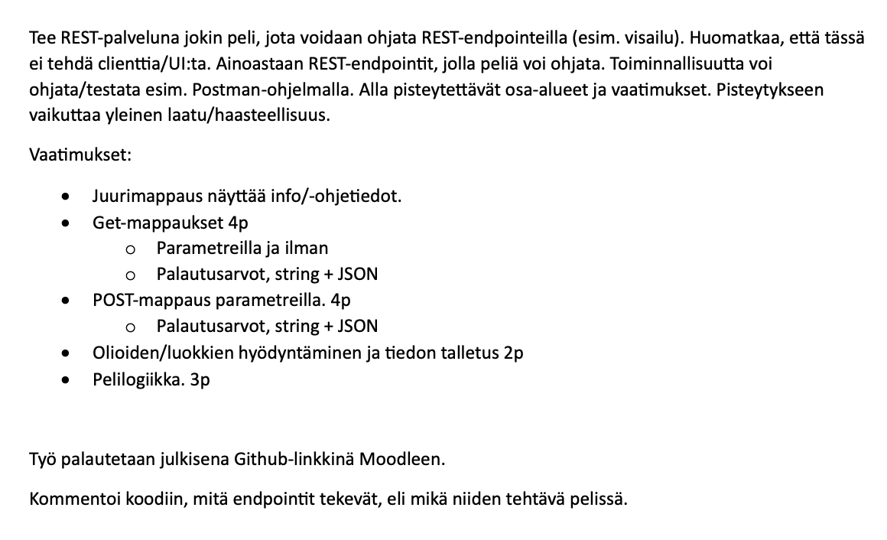

# Java-ohjelmoinnin REST-harjoitus

Tämä projekti on REST-pohjainen tietovisa, jossa testataan musiikkitietämystäsi. Sovellus käynnistyy osoitteessa http://localhost:8080.

## Kuvaus

Musavisa tarjoaa viisi tietovisakysymystä. Peliä pelataan REST-endpointien avulla, joten voit ohjata peliä esimerkiksi Postman-ohjelmalla. Pelin tarkoituksena on vastata kysymyksiin oikein ja edetä seuraavaan kysymykseen.

## Endpointit

- GET /: Pelin tervetulotoivotus ja ohjeet
- GET /question: Näytä kysymys
- GET /question/1-5: Siirry tiettyyn kysymykseen
- POST /answer: Vastaa kysymykseen
- GET /reset: Nollaa peli ja aloita alusta

## Tehtävänanto

